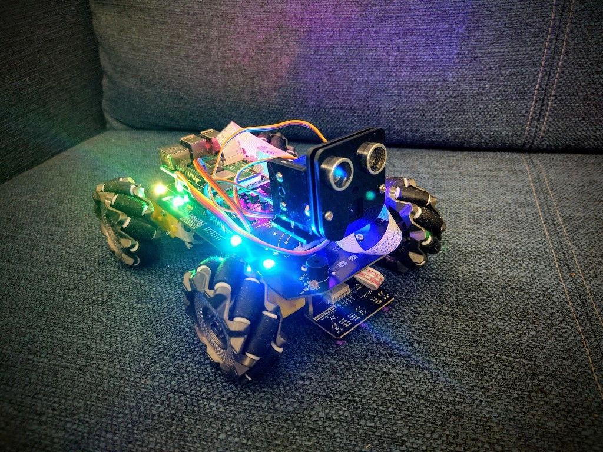

# Freenove_4WD_Smart_Car_Kit_for_Raspberry_Pi_Robot

This repo contains ROS2 workspaces for my Freenove 4WD Smart Car Kit for Raspberry Pi

## workspaces

This repo contains the following workspaces:

* simple_ws: this workspace uses simple topics and services for controlling the basic functions of the robot. Beginners should have a look here first.